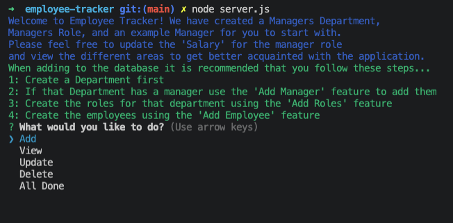

# **Employee Tracker**
  
  
  ## **Table of Contents**
  * [Contributors](#contributors)
  * [Demo](#demo)
  * [Installation](#installation)
  * [Usage](#usage)
  * [Questions](#questions)
  * [License](#license)
      
      
  ## **Description**
  This is a CLI based application that allows the user to create and update a database with their companies information. It will allow the user to store departments, roles, employees. The user can add all of them, update them, view them, and delete them as they would like.
      
   ## **Contributors**
  * [Robert Anderson](https://github.com/reanderson89)

  ## **Technology Stack**
  javascript, node.js, colors, inquirer, mysql, console.table
      
  ## **Demo**
  - 
  - 
  - 
  - 
  - 

  
  ## **Installation**
  Enter 'npm install' into the command line.
      
  ## **Usage**
  Enter 'node server.js' into the command line to run the program
      
  ## **Questions**   
  ####    **For any questions or inquiries please contact me at,**
  * #### **GitHub:** [@reanderson89](https://github.com/reanderson89)
  * #### **Email:** reanderson89@gmail.com
    
  ## **License**
  MIT
      

